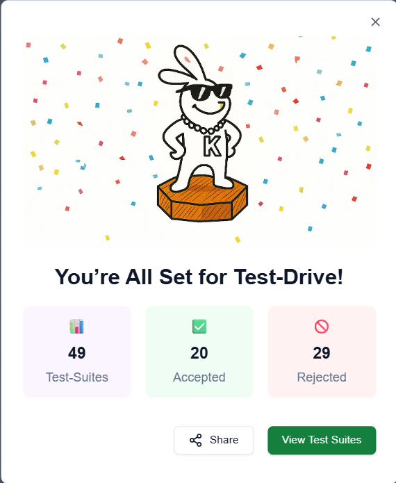

# CRUDify

CRUDify is a full-stack CRUD (Create, Read, Update, Delete) application designed to manage tasks efficiently. This project demonstrates a modern web application architecture with a React-based frontend and a Node.js/Express backend connected to a MongoDB database.

---

## Project Description

CRUDify allows users to create, view, update, and delete tasks through a user-friendly interface. The frontend communicates with the backend REST API to perform all operations, making it a practical example of a decoupled client-server architecture.

---

## Frontend

The frontend is built using **React** with functional components and hooks. It provides an intuitive interface for managing tasks.

### Features:
- Display a list of all tasks
- Add new tasks
- Edit existing tasks
- Delete tasks
- Real-time updates after any CRUD operation

### Technology Stack:
- React (with hooks)
- JavaScript (ES6+)
- CSS for styling

### Structure:
- Components are organized under `src/component/`
- API calls are handled via utility functions in `src/utils/api.js`
- Styling is managed through CSS files

---

## Backend

The backend is a RESTful API server built with **Node.js** and **Express.js**, connected to a **MongoDB** database using **Mongoose** ODM.

### Features:
- CRUD endpoints for task management
- Middleware for parsing JSON and handling CORS
- Environment variable management with dotenv
- Development support with nodemon for hot reloading

### Technology Stack:
- Node.js
- Express.js
- MongoDB with Mongoose
- dotenv for environment variables
- cors for cross-origin resource sharing
- body-parser and cookie-parser for request parsing

### Running the Backend:
- Start the server using `npm run dev` in the backend directory
- The server listens for API requests and interacts with the MongoDB database

---

## Postman API Testing

You can test the backend API endpoints using Postman. Import the Postman collection from the following temporary link:

[Postman Collection Link](https://documenter.getpostman.com/view/35001767/2sB2xBDVUA)

---

## Getting Started

### Prerequisites
- Node.js and npm installed
- MongoDB instance running (local or cloud)

### Running Frontend
1. Navigate to the frontend directory: `CRUDify/fronted/crud application/`
2. Install dependencies: `npm install`
3. Start the React development server: `npm start`

### Running Backend
1. Navigate to the backend directory: `CRUDify/backend/`
2. Install dependencies: `npm install`
3. Start the backend server: `npm run dev`

---

## How to Run Tests
Run the test suite with coverage:
```
npm test
```

## Testing Frameworks/Tools Used
- Jest: JavaScript testing framework
- Supertest: HTTP assertions for API testing
- mongodb-memory-server: In-memory MongoDB for integration tests

## Test Coverage
The test coverage report is generated in the `coverage/lcov-report` directory.

<<<<<<< HEAD
To view the coverage report, open:
```
CRUDify/backend/coverage/lcov-report/index.html
```
in your browser.
=======
To view the coverage report, Cick on below link:

.[Test Report](https://shravan9393.github.io/CRUDify/)
>>>>>>> ce0fb3a41887e8728a8e559eae53e6fd8f149471


##  Keploy AI Test Report

Here is a screenshot from the Keploy dashboard showing successful API test cases:

### test-details



### test-summary


### Keploy Api Chrome Extension 


##  GitHub Actions (CI/CD) Integration

This project uses GitHub Actions for continuous integration.  
On each push, the workflow runs:


- Install Keploy CLI
- Run Keploy test suite

🔗 [View GitHub Actions Workflow File](.github/workflows/keploy-api-test.yml)  


---

## Author

Developed by Shravan

---


